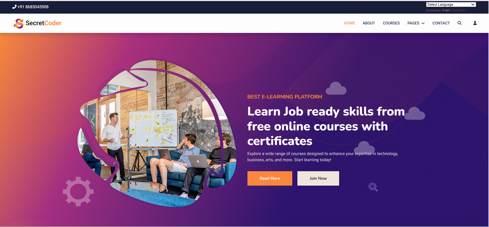

# 🐍 Python Django Web Application



This project is a web application built using Python and Django Framework.

It demonstrates the core functionalities of a modern web application, including authentication, dynamic pages, model-based data handling, and a clean project structure.

## 📌 Introduction

This repository contains a fully functional Django-based web application created for learning and development purposes.

The project follows the MVC/MVT architecture, providing clean code practices and real-time features implemented using Django models, views, templates, and static files.

Whether you're a beginner exploring Django or a developer looking for a structured project, this repository will guide you through the essentials of backend development with Python.

## ⭐ Features

- Django-powered dynamic web pages
- User registration and login system
- Secure authentication using Django Auth
- Database integration using Django ORM
- CRUD operations for multiple modules
- Responsive frontend using HTML, CSS & Bootstrap
- Template inheritance for clean UI structure
- Well-organized project folders (apps, static, templates)

## 🚀 Getting Started

### ✔ Prerequisites

Make sure you have the following installed:

- Python 3.x
- pip
- Virtual environment (recommended)
- Django

### 🛠 Installation

#### Clone the repository
````
git clone https://github.com/keerti1924/Python-Django.git 
````

#### Navigate to the project directory
````
cd Python-Django
````

#### Create a virtual environment
````
python -m venv venv
````

#### Activate the virtual environment
- Windows:
    ````
    venv\Scripts\activate
    ````
- Mac/Linux:
    ````
    source venv/bin/activate
    ````

#### Install dependencies
````
pip install -r requirements.txt
````

#### Run migrations
````
python manage.py migrate
````

#### Start the server
````
python manage.py runserver
````

#### Visit in browser
Open http://127.0.0.1:8000/

## 🧰 Technologies Used

- Python
- Django Framework
- HTML5
- CSS3
- Bootstrap 5
- SQLite / MySQL
- Django ORM

📱 The website is fully responsive and works smoothly across all devices.

## 🤝 Contributing

Contributions, issues, and feature requests are welcome! Check the issues page to get started.

## ⭐ Show Your Support

Give this project a ⭐️ star if you find it helpful!

## 📄 License

This project is free to use and does not include any license restrictions.
